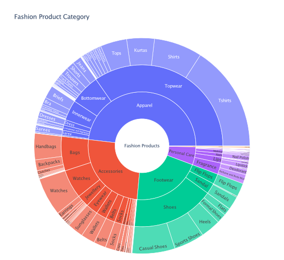
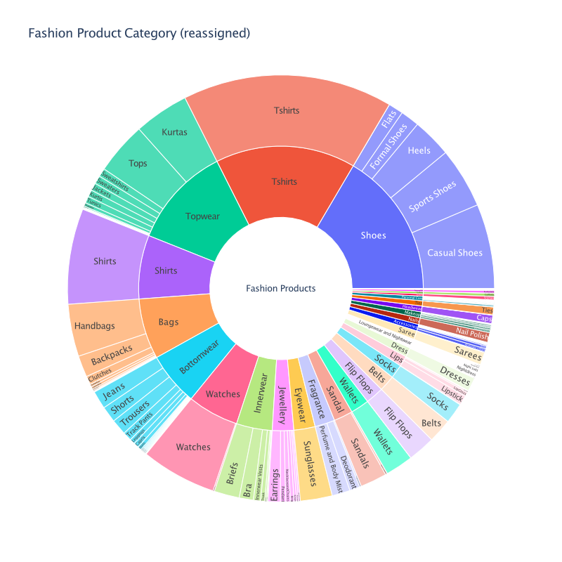
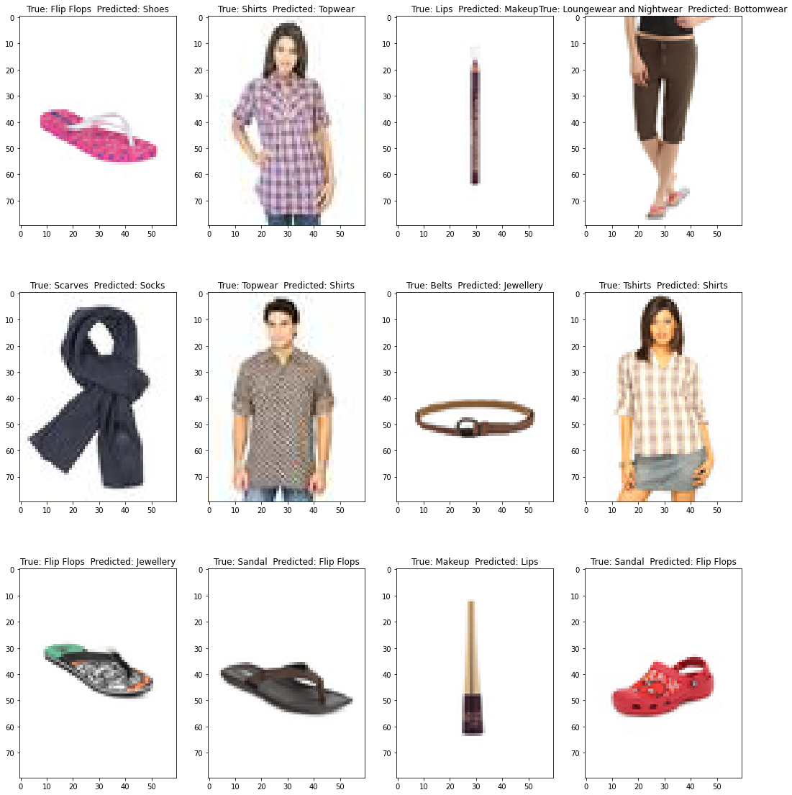
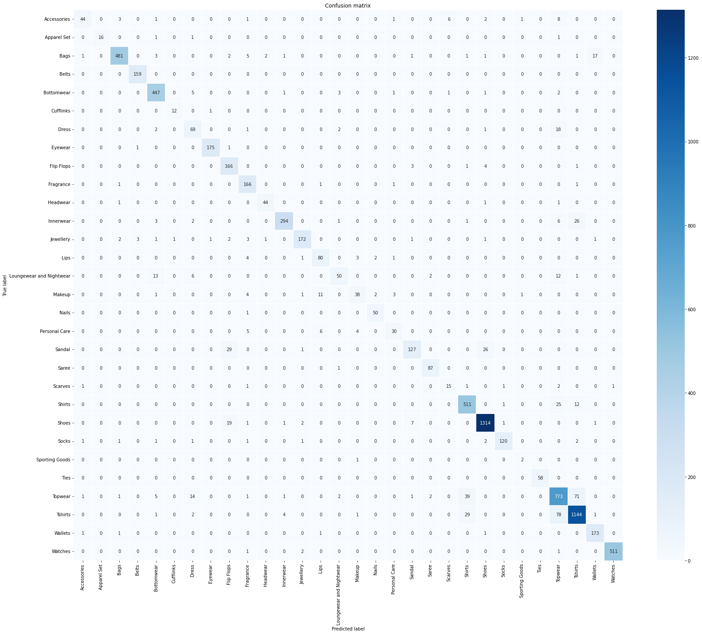
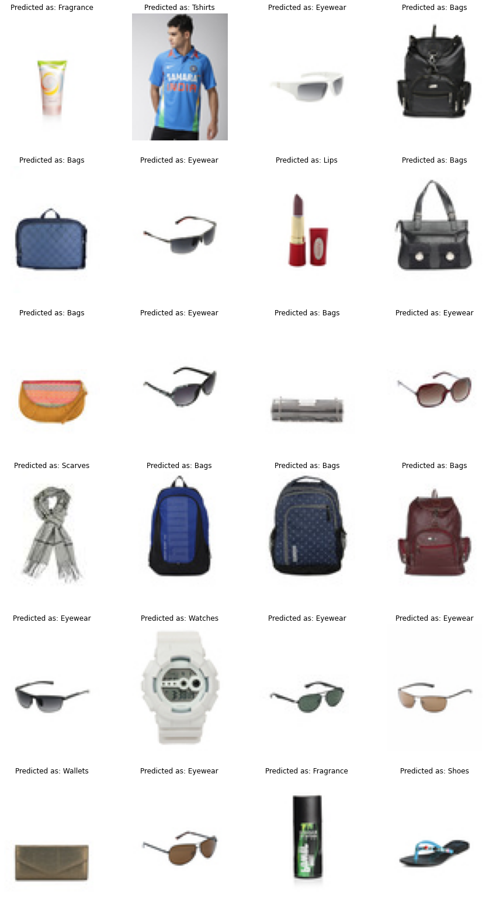
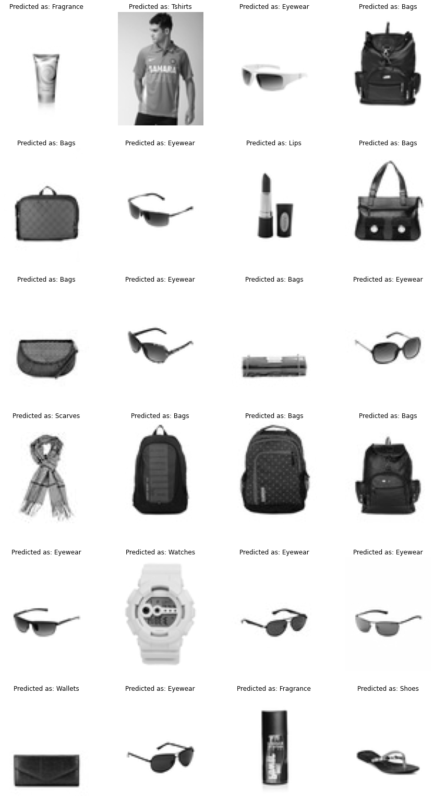

# CNN Classifier on Fashion Product Images

Fashion e-commerce accounted for roughly [29.5 percent of the total fashion retail sales in the United States](https://www.statista.com/statistics/281594/share-of-apparel-and-accessories-sales-in-total-us-e-retail-sales/) (2020). Yet, one of the main problems they face is categorizing these apparels, such as clothing and accessories, from the images, especially when the categories provided by the brands are inconsistent. 

In general, image classification poses an exciting computer vision puzzle and has gotten many deep learning researchers' attentions. Building a classification model for fashion product images would be an excellent start to dive into deep neural networks. This project aims to get myself hands-on experience dealing with the imbalanced dataset, building Convolutional Neural Networks (CNN) for image classification with **Keras API** and evaluating the model performances.

## Documentation

[Summary Report](Report_Slides/Final_Capstone_Report.pdf)

[Slides](Report_Slides/Final_Capstone_Slides.pdf)

[EDA Notebooks](Capstone2/EDA_Fashion_Products.ipynb)

Modeling Notebooks: [ColorImages](TF2_CNN_Fashion_Products_30_BatchNorm_ver2.ipynb), [GrayScale](**TF2_CNN_FashionProducts_30_GrayScale_BatchNorm_ver2.ipynb**)

## 1. Data Sources

[**Fashion Product Images**](https://www.kaggle.com/paramaggarwal/fashion-product-images-small) **(545.62 MB, 44k colored images of size 80 x 60 x 3)**

*  **styles.csv** contains 44446 rows and 10 columns.
* **44441** **images** (*.jpg).  Five images (id = 12347, 39401, 39403, 39410, 39425) are missing.

## 

## 2. Data Wrangling and Feature Engineering

Here, we focus on data cleaning and feature engineering of **style.csv**. 

1. Refine the **Product Class** for Image Classification: 
   We defined a new categorical feature, `Class`, which combines the three hierarchical labels (`masterCategory`, `subCategory`, `articleType`). The **number of categories in** `Class` is **no larger than 35**. 
   
   **Take-away**
   
   * The size of refined DataFrame `style` is 44440-by-11.
   * The new categorical feature `Class` has 31 product labels.
   * However, about 105 samples listed as **Free Items** are mislabeled. We will address it in next section.
   
2. Assign Classes to the Images Under the Ambiguous Category - Free Items
   **How to relabel the** **_Free Items_**? The column `productDisplayName` contains various product descriptions/keywords, such as “watch”, “Saree”, etc. We reassigned proper `Class` to *Free Items* based on these keywords.

3. Export the Refined Spreadsheet
   The refined spreadsheet (44440-by-11) was saved as **styles_cleaned.csv**. 

## 3. EDA

For multi-classification problems, it is essential to check the number of samples (images) in each class. Ideally, we preferred the representations to be about the same for every class (balanced dataset). Yet reality, the sample proportion would vary with classes.  

We firstly examine the proportion of categorical labels in the raw data again (**styles.csv**), and the one after feature engineering (**styles_cleaned.csv**). 

Then, we randomly show subset of images for qualitatively checking how product varies within the same category (in [EDA notebook](EDA_Fashion_Products.ipynb)).

Figure 1: Proportion of categorical labels in the original data frame (_styles.csv_). The inner ring is the **masterCategory**; the middle one is **subcategory**; the outer is **articleType**.

**Figure 1 Take-away:**

- The number of samples for each Category is highly imbalanced.
- Four dominated `masterCategory` are 1) *Apparel*, 2) *Accessories*, 3) *Footwear* and 4) *Personal Care*.
- Around 50% of samples are *Apparel*, in which *Topwear* is the dominated subCategory.

Figure 2: The proportion of refined categorical labels. The inner ring shows the refined **Class** with 30 product labels; the outer ring shows the labels of **articleType**.

**Figure2 Take-away:**

- The categorical feature has `Class` 30 classes.
- The number of samples `Class` is still imbalanced, but the measure of balance is improved from 0.73 to __0.81__ (c.f., [report](Report_Slides/Final_Capstone_Report.pdf) Sec. 2.5).
- Most common classes are Shoes, Tshirt, Topwear
- In contrast the small components like the Scarves, Cufflinks, Apparel Set and Sporting Goods are quite rare in our data.
- We might expect less accurate predictions on these minor classes.
- Whether the accuracy is the right score to measure the performance and validation?

## 4. Pre-processing and Training Data Development

1. **Scale the Pixel Values** - Each image is in size of 80-by-60 with 3 color channels, and the value is in the range of 0 to 255. 
   In addition, Keras API provides option to train with color (default setting) or grayscale images (color_mode="grayscale").
2. **Image Augmentation** - We only perform __horizontally flipping__ randomly on images. Most of the pictures are well centered and correctly orientated, so applying shifts or rotations would not improve the model performances.
3. **Split Train-validation and Hold-on Sets** - We split the data into a **training (72%)** and a **validation (18%)** and a **hold-on (10%)** sets. 
   We pick the best model based on the validation accuracy and confirm the model performances with the hold-on set that, ideally, should have an accuracy about the same as the validation. We set a **batch size of 32**. Each of the train and validation datasets are divided into groups of 32 images.

 

## 5. CNN Model

__CNN architecture__:
Input --> Convo (ReLU) --> BatchNorm 
		  --> Convo (ReLU) --> BatchNorm  --> Max Pooling 1  --> Dropout (0.2)
		  --> Convo (ReLU) --> BatchNorm
		  --> Convo (ReLU) --> BatchNorm  --> Max Pooling 2  --> Dropout (0.2)
 		 --> FC layer (ReLU) --> BatchNorm  --> Dropout (0.25)
 		 --> Output (Softmax)

We add two sets of convolutional and pooling layers, one with 32 filters and the other with 64. Having more layers does not improve the accuracy significantly but increases the training time. 

__Loss function and metric__:
	loss = "categorical_crossentropy"
	metrics = "accuracy"
	batch_size = 32

__Training platform__: Google Clab

## 6. Model Prediction and Evaluation

CNN model with the same architecture but trained with either __color__ or __grayscale__ images. The two model have similar performances.

| Dataset                       | Splits          | _Loss_    | _Accuracy_ |
| ----------------------------- | --------------- | --------- | ---------- |
| *Color images*  (80 x 60 x 3) | Training        | **0.196** | **0.935**  |
|                               | Validation      | 0.285     | 0.913      |
|                               | Hold-on  (test) | **0.189** | **0.940**  |
| *Gray images*  (80 x 60 x 1)  | Training        | 0.162     | 0.946      |
|                               | Validation      | **0.273** | **0.917**  |
|                               | Hold-on (test)  | 0.191     | 0.938      |

### 6.1 Model trained with color images (validation sets)

Figure 3: Confusion matrix shows the true and label when testing the model on the **validation** sets. This model is a CNN classifier trained with the color images. The model is commonly confused with “Sandal” and “Shoes”; “Topwear” and “Shirts”.

__Figure3 Take-away__:

* The classifier has the least performance on **Scarves (#20)** and **Sporting Goods (#24)**. 
* Note that the **Sporting Goods** has the least number of images (25 total; 19 used in training) across all classes, thus we expected our model made more error in **Sporting Goods** than in the rest. 
* For **Scarves**, the prediction fails when photo shows a model wearing a scarf, or its texture/shape is like other products (Accessories, Jewellery, or socks), see Figure 8 in [report](Report_Slides/Final_Capstone_Report.pdf).

Example of misclassified items (test sets). The model is commonly confused with “Sandal” and “Shoes”; “Topwear”, “T- Shirts” and “Shirts”. These items are sometimes ambiguous to classified with human eyes.

### 6.2 Model trained with grayscale images (validation sets)

Figure 4: Confusion matrix shows the true and label when testing the model on the validation sets. This model is a CNN classifier trained with the grayscale images. Again, Sandal” and “Shoes”; “Topwear”, “T- Shirts” and “Shirts” are ambiguous for the classifier.

* The classifier has the least performance on **Sporting Goods (#24)** as there’s not enough samples in the dataset. 
* The performance on **Scarves (#20)** has improved compared to the model trained with color images.

##  7. Prediction on the Unknow Items

The predations on the mislabeled images that were originally listed as “*Free Items.*”

Figure 5: Perditions on unknown items. The text on the top of each image is the predicted label. The model trained with color image (left), or grayscale image (right) gives the same results.

##  8. Conclusion

* Considering the provided product labels are imbalanced and have high cardinality (too many unique values), we defined a new set of __30 classes__ based on the three categorical features in the original data. 

* We trained CNN model on classifying fashion product images (color and grayscale) into **30 classes**, and both reached the accuracy of 0.91 - 0.92 on the validation set. 

* As expected, the model has the least performance in the class with fewer samples (“Sporting Goods,” 25 images). Besides, 

* The classifier is commonly confused when images belong to the same master category (ex: “Topwear”, “T-shirt” and “Shirts” are in the same mastercategory “Topwear”), or high similarity in product shape (Sandal” and “Shoes”). This could be improved by providing images with higher resolution, data augmentation, or refining the image labels.

  

## 9. Future Work

* To improve the model classifying the fined details in products, one can use higher resolution images for training. Yet, this would cost more training time as trainable parameters will be scaled up with the input dimensions. 
* Try fine tune the current CNN architectures. For instance, adding a pooling layer after each convolutional layer; for the fully connect layers, using two small dense layers (at size of 256 and 128) instead of a single large dense layer.

- There are countless CNN architectures or pre-trained models. One could use __transfer learning__ to take advantage of those pre-trained models (ex: ResNet, VGG).
- Computer vision is the thrived research field, and new ideas/models are coming out time by time.

